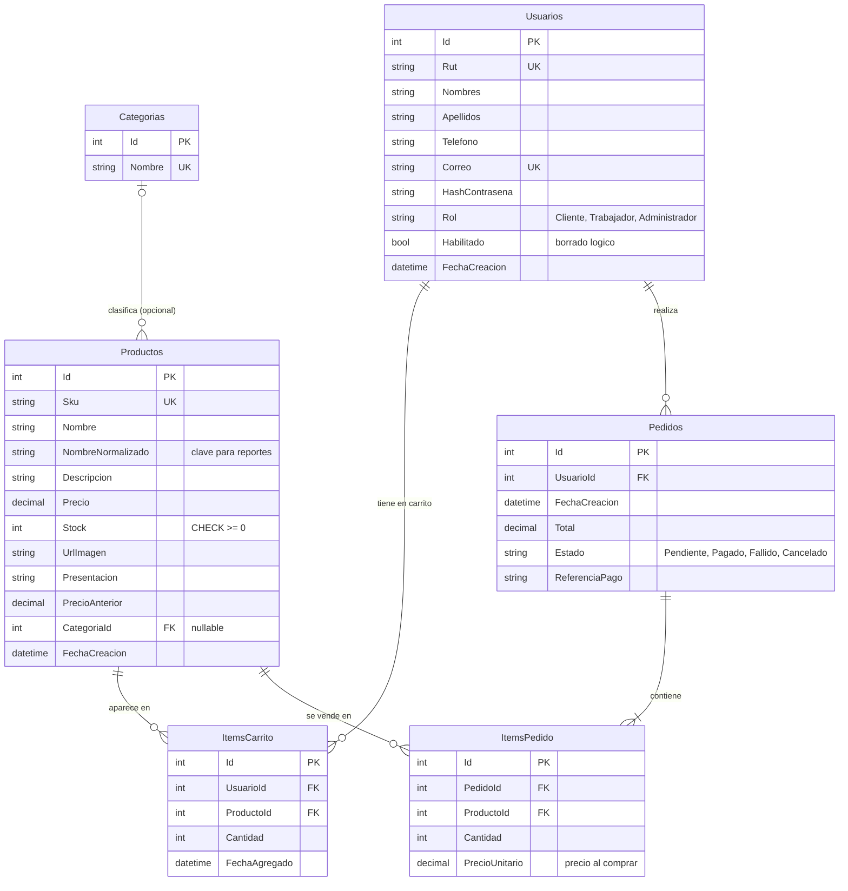

# Modelo de datos (ER)

```mermaid
erDiagram
    Categorias |o--o{ Productos : "clasifica (opcional)"
    Usuarios ||--o{ ItemsCarrito : "tiene en carrito"
    Productos ||--o{ ItemsCarrito : "aparece en"
    Usuarios ||--o{ Pedidos : "realiza"
    Pedidos ||--|{ ItemsPedido : "contiene"
    Productos ||--o{ ItemsPedido : "se vende en"

    Usuarios {
        int Id PK
        string Rut UK
        string Nombres
        string Apellidos
        string Telefono
        string Correo UK
        string HashContrasena
        string Rol "Cliente, Trabajador, Administrador"
        bool Habilitado "borrado logico"
        datetime FechaCreacion
    }
    Categorias {
        int Id PK
        string Nombre UK
    }
    Productos {
        int Id PK
        string Sku UK
        string Nombre
        string NombreNormalizado "clave para reportes"
        string Descripcion
        decimal Precio
        int Stock "CHECK >= 0"
        string UrlImagen
        string Presentacion
        decimal PrecioAnterior
        int CategoriaId FK "nullable"
        datetime FechaCreacion
    }
    ItemsCarrito {
        int Id PK
        int UsuarioId FK
        int ProductoId FK
        int Cantidad
        datetime FechaAgregado
    }
    Pedidos {
        int Id PK
        int UsuarioId FK
        datetime FechaCreacion
        decimal Total
        string Estado "Pendiente, Pagado, Fallido, Cancelado"
        string ReferenciaPago
    }
    ItemsPedido {
        int Id PK
        int PedidoId FK
        int ProductoId FK
        int Cantidad
        decimal PrecioUnitario "precio al comprar"
    }
```